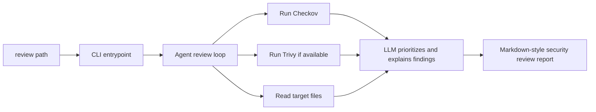

# Agentic Kubernetes IaC Security Reviewer

[](https://github.com/perugoal2/Agentic-Kubernetes-IaC-Security-Reviewer/actions/workflows/pr-tests.yml)

An agent-driven CLI that reviews Kubernetes and IaC files with security scanners, produces a prioritized human-readable report, and can stage remediated file copies in a separate patched workspace.

## Why This Exists

Most scanner output is accurate but noisy. This project keeps the scanner signal, then adds an LLM review layer to:

- merge and prioritize findings
- explain the real risk in plain English
- suggest concrete remediations
- generate a report you can read or save directly to a file
- stage proposed fixed file copies separately from your source files

## Features

| Feature | What it does |
| --- | --- |
| CLI review command | Run `review <path>` against a file or directory |
| Agent-generated report | Produces a concise, prioritized security review in stdout or a report file |
| Bounded remediation loop | Retries failed fixes up to a configurable limit with no infinite patch loop |
| Folder remediation workspace | Preserves relative paths so multiple files in a reviewed folder can be patched together under `patches/` |
| Checkov integration | Scans Kubernetes and IaC config with structured output |
| Trivy integration | Uses Trivy config scanning when available on your machine |
| File output | Save the generated report with `--output` or `-o` |
| Local-first workflow | Works from your repo and your existing Python virtualenv |

## What It Reviews

This repo is currently set up to review infrastructure files such as:

- Kubernetes manifests
- Terraform
- Dockerfiles
- other IaC-style config supported by the configured scanners

## How It Works



## Project Layout

| File | Purpose |
| --- | --- |
| `cli.py` | User-facing CLI entrypoint |
| `agent.py` | Anthropic-powered review logic |
| `tools.py` | Scanner wrappers for Checkov and Trivy |
| `fixtures/` | Sample insecure manifests for testing |
| `patches/` | Generated patched copies created during remediation attempts |
| `report.md` | Example generated report output |

## Demo Files

The repo includes a small set of demo inputs and patched outputs so you can see the remediation flow end to end.

There are two different output types in this project:

- Report output: the markdown-style review printed to stdout or written with `--output`.
- Remediation output: generated fixed file copies written under `patches/`.

Source demo files in `fixtures/`:

- `fixtures/bad.yaml`
- `fixtures/app/app.yaml`

Generated patched demo files in `patches/`:

- `patches/fixtures/bad.yaml`
- `patches/fixtures/app/app.yaml`

The files under `fixtures/` are the insecure examples you review. The files under `patches/` are generated outputs from remediation attempts and are safe to inspect, diff, or delete between runs.

## Prerequisites

Before you run the CLI, make sure you have:

- Python 3.11+
- a virtual environment for the project
- an Anthropic API key available in your environment
- Checkov installed in the project environment
- Trivy installed only if you want Trivy findings included

## Setup

### 1. Create and activate a virtual environment

```powershell
python -m venv .venv
.\.venv\Scripts\Activate.ps1
```

### 2. Install dependencies

```powershell
python -m pip install -r requirements.txt
python -m pip install -e .
```

The editable install creates the `review` CLI command for the active environment.

### 3. Set your Anthropic API key

PowerShell session only:

```powershell
$env:ANTHROPIC_API_KEY = "your_api_key_here"
```

Persistent user environment variable:

```powershell
[Environment]::SetEnvironmentVariable("ANTHROPIC_API_KEY", "your_api_key_here", "User")
```

Then restart your terminal or VS Code window.

## Usage

### Review a file

```powershell
review .\fixtures\bad.yaml
```

### Save the report to a file

```powershell
review .\fixtures\bad.yaml --output .\report.md
```

`--output` only controls where the written review report goes. It does not change where remediated file copies are staged.

### Limit remediation retries

```powershell
review .\fixtures\bad.yaml --max-fix-attempts 2
```

The agent stops retrying after the first successful validation or when the retry budget is exhausted.

### Remediate a folder

When you review a directory, the remediation flow writes remediated file copies into a mirrored workspace under `patches/<folder-name>/...` so multiple files can be fixed together and validated as a directory.

Example:

```powershell
review .\fixtures
```

This can produce patched outputs such as:

- `patches/fixtures/bad.yaml`
- `patches/fixtures/app/app.yaml`

Short flag:

```powershell
review .\fixtures\bad.yaml -o .\report.md
```

### Run without activating the virtual environment

```powershell
.\.venv\Scripts\review.exe .\fixtures\bad.yaml
```

### Review a directory

```powershell
review .\manifests
```

## Example Output

The CLI produces a markdown-style report like this:

```text
## IaC Security Review Report

CRITICAL: Privileged container configuration
Risk: Container escape and host compromise.
Fix: Set privileged to false and disable privilege escalation.
```

That report is separate from any remediated file copies written under `patches/`.

## Trivy Support

Trivy is optional in the current workflow, but if you want it included you need the standalone CLI installed and available to the process.

Typical Windows install:

```powershell
winget install AquaSecurity.Trivy
```

Check whether the command resolves:

```powershell
trivy --version
```

If `trivy` is not on `PATH`, the project also checks for a local executable here:

```text
bin/trivy.exe
```

## Troubleshooting

### `review` is not recognized

Activate the virtual environment first:

```powershell
.\.venv\Scripts\Activate.ps1
review .\fixtures\bad.yaml
```

Or call the installed launcher directly:

```powershell
.\.venv\Scripts\review.exe .\fixtures\bad.yaml
```

### `trivy` is not recognized

That means the Trivy CLI is not installed or not on `PATH`.

```powershell
trivy --version
```

If that fails, install it with `winget` or place `trivy.exe` in `bin/trivy.exe`.

### Anthropic authentication fails

Verify the environment variable is set:

```powershell
echo $env:ANTHROPIC_API_KEY
```

### Scanner output works but the report is missing

Make sure you are running the CLI from the project environment where dependencies were installed:

```powershell
python -m pip install -e .
```

## Current Behavior Notes

- Checkov is wired directly into the Python workflow.
- Trivy is used when available as an external CLI.
- The `review` command prints the report to stdout.
- `--output` writes that report to a file such as `report.md`.
- `--max-fix-attempts` bounds remediation retries and prevents infinite fix loops.
- Directory remediation preserves relative paths in `patches/` so the agent can stage multi-file fixes safely.
- Files under `patches/` are generated remediation artifacts, not the main review report.

## Quick Start

If you just want the shortest path to a working review:

```powershell
python -m venv .venv
.\.venv\Scripts\Activate.ps1
python -m pip install -r requirements.txt
python -m pip install -e .
$env:ANTHROPIC_API_KEY = "your_api_key_here"
review .\fixtures\bad.yaml -o .\report.md
```
